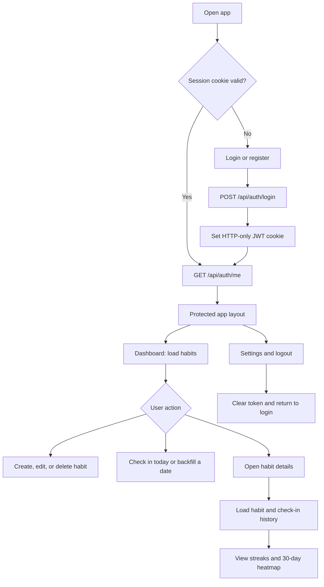
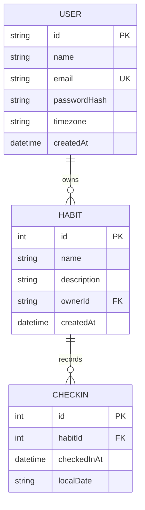

# Habitly

Habitly is a full-stack habit tracker. Users create an account, manage habits, check in once per local day, and monitor current and longest streaks.

## Stack

- **Frontend:** React 19, Vite, React Router, Tailwind CSS, Axios, lucide-react
- **Backend:** Node.js, Express 5, Prisma 6, PostgreSQL
- **Authentication:** JWT stored in an HTTP-only cookie
- **Time handling:** IANA timezones and `YYYY-MM-DD` local dates

## Project Layout

```text
backend/     Express API, Prisma schema, migrations, controllers and utilities
frontend/    React application, routes, pages, components and API clients
```

## Local Setup

### 1. Install dependencies

```powershell
cd backend
npm install

cd ..\frontend
npm install
```

### 2. Configure the backend


The database must be PostgreSQL. Apply the checked-in Prisma migrations:

```powershell
cd backend
npx prisma migrate deploy
npx prisma generate
```

For local schema development, use `npx prisma migrate dev` instead of `migrate deploy`.

### 3. Start both applications

Terminal 1:

```powershell
cd backend
npm run dev
```

Terminal 2:

```powershell
cd frontend
npm run dev
```

Open `http://localhost:5173`.

The API health check is `GET http://localhost:5000/` and returns database status.

## Development Commands

### Backend

```powershell
npm run dev       # Start with nodemon
npm start         # Start once
npm test          # Placeholder; no backend tests are configured
```

### Frontend

```powershell
npm run dev       # Start Vite
npm run build     # Create a production build
npm run preview   # Preview the production build
```

## User Workflow

1. Register with name, email, password, and timezone.
2. Log in. The JWT is set as an HTTP-only `token` cookie.
3. On application startup, the frontend calls `/api/auth/me` to restore the session.
4. Unauthenticated users are redirected to `/login`; authenticated users enter the protected app layout.
5. From the dashboard, create, edit, delete, and complete habits.
6. Open a habit to view streak statistics, the last 30 days, and check-in history.
7. A check-in may be for today or a previous valid local date, but never a future date or a date before habit creation.
8. Log out from Settings or the profile menu.



## Data Model



Streaks are calculated on the backend from each user's timezone. The current streak includes today, or yesterday when today has not been completed; the longest streak is calculated across all recorded local dates.